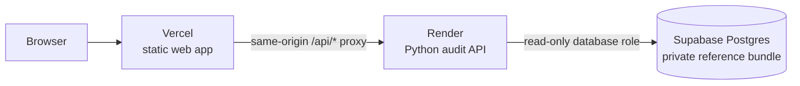

# PackSense

**Evidence-aware decision support for food packaging.** PackSense connects a food and its real storage and transport conditions to sourced reference data, engineering checks, and an auditable result. It reports missing evidence instead of inventing a suitable package or shelf-life prediction.

[Live app](https://packsense-web.vercel.app) · [API status](https://packsense-evaluation.onrender.com/api/status) · [Deployment guide](docs/deployment.md) · [Workspace guide](web/README.md)

> **Current release: evidence audit.** The hosted form evaluates one food scenario and can display source-backed catalogue leads and evidence gaps. It does **not** approve a package, deploy a trained material model, or predict shelf life. A valid submission may return `not_ready` until reviewed complete-package, transfer, and trial evidence is available.

## At a glance

| Capability | Current state |
| --- | --- |
| Food and material references | The hosted database contains the supplied 5,000-food and 81-material workbooks as one versioned, hash-checked bundle. Raw workbooks are not in Git. |
| Single-scenario evaluation | Search a source food, enter pack size and operating conditions, and run the Python audit through the browser. |
| Saved demonstration results | The Results tab opens two batch-engine decisions for raw asparagus and broccoli, with source links, input provenance, and explicit evidence gaps. The saved examples are illustrative, not live user evaluations. |
| Batch evaluation | Audit an operator-supplied scenario CSV against configured references and export a traceable JSON report. |
| Published-use catalogue | Explore nine manufacturer-listed food and package applications with source links. These are research leads, not approvals. |
| Engineering checks | Validate input, enrich exact references, build requirement cards, and run bounded produce or transfer checks when their evidence is present. |
| Ranking and shelf-life prediction | Withheld. No real suitability-label set, approved finished-package catalogue, or measured trial-outcome set is supplied. |

The [Kaggle notebook](notebooks/packsense-ai.ipynb) audits reference data and contains guarded exploratory training code. It has **not** produced a validated or deployed model. See [material training readiness](docs/material-training-readiness.md) and [shelf-life training](docs/shelf-life-training.md) for the evidence gates.

## Show the evidence-backed demo

Open the [live app](https://packsense-web.vercel.app), choose **Explore PackSense**, then **Results**. The saved batch report contains two actual PackSense audit rows: 150 g raw asparagus and 400 g raw broccoli. It records the exact food and material source hashes used to generate it. The inspector links the food-reference citations and manufacturer-listed uses. Both rows are **Needs evidence** because the available workbooks and supplier list do not establish complete-package performance or a validated shelf-life outcome.

The five-day target, 90% humidity, road journey, handling, and exact temperatures are illustrative inputs, not measurements or predictions. The manufacturer lists those pack sizes and a 1–10 °C storage range; its source-rights and food-identity review remain pending. Use **Evaluate** for a new live scenario. The saved demo can be rebuilt from the reviewed files with:

```sh
python -m packsense.demo_report "path/to/food-reference.xlsx" "path/to/material-reference.xlsx"
```

The command checks the [demo manifest](data/demo_scenarios.v1.json) against the source hashes before publishing [the decision report](web/demo/report.json) and [its citation context](web/demo/evidence.json). It will fail when the reviewed inputs change.

## Hosted architecture



| Service | Responsibility | Live resource |
| --- | --- | --- |
| Vercel | Builds and serves `web/`; forwards `/api/*` to Render. | [packsense-web.vercel.app](https://packsense-web.vercel.app) |
| Render | Serves the Python API, checks reference hashes, and runs evidence-gated evaluations. | [packsense-evaluation.onrender.com](https://packsense-evaluation.onrender.com) |
| Supabase | Stores the active, versioned workbook pair in a private PostgreSQL schema. | [PackSense project](https://supabase.com/dashboard/project/qmxvqbqrjpedfqvyxdpq) |

The browser receives neither database credentials nor workbook files. Render uses a read-only database login; source imports and bundle activation use a separate administrator connection. The [deployment guide](docs/deployment.md) covers migrations, imports, secrets, host settings, verification, and rollback.

Both hosts deploy from the private [`OfficialAbhinavSingh/PackSense`](https://github.com/OfficialAbhinavSingh/PackSense) fork's `main` branch. The reviewed upstream repository is [`Aspirant200715/PackSense`](https://github.com/Aspirant200715/PackSense). After merging an upstream change, sync the fork to trigger both Git-linked deployments:

```sh
gh repo sync OfficialAbhinavSingh/PackSense --source Aspirant200715/PackSense --branch main
```

## Run locally

Use Python 3.11 or newer. CI uses Node.js 24 for frontend tests and the Vercel build. Commands below run from the repository root unless noted.

```sh
python -m pip install -r requirements.txt -r requirements-web.txt
```

### Explore the source-backed catalogue

```sh
python -m packsense.web_server --port 4173 \
  --public-candidates data/public_catalogue_candidates.v1.json
```

Open `http://127.0.0.1:4173/`. This mode needs no database or private workbook. It shows published applications and the eight-stage workflow without running a food-specific evaluation.

### Evaluate one food

Provide your own local food and material reference workbooks. They are selected by the server operator, never uploaded by the browser.

```sh
python -m packsense.web_server --port 4173 \
  --food-master "path/to/food-reference.xlsx" \
  --material-master "path/to/material-reference.xlsx" \
  --public-candidates data/public_catalogue_candidates.v1.json
```

Open the app, choose **Evaluate a food**, select an exact source row, and enter target shelf life, quantity, storage, transport, humidity, and handling conditions. The browser sends a bounded scenario to `POST /api/evaluate`; the backend runs the same audited pipeline used for batches. A target life is an input requirement, **not** a predicted or measured outcome. Missing source properties can block submission, and missing package evidence can leave the result `not_ready`.

### Audit a scenario batch

```sh
python -m packsense.web_server --port 4173 \
  --scenarios "path/to/scenarios.csv" \
  --food-master "path/to/food-reference.xlsx" \
  --material-master "path/to/material-reference.xlsx"
```

Download the blank CSV header from `/api/scenario-template` while the server is running. Each row represents one food **and** its pack, storage, and transport scenario; a food-reference row alone is not a scenario. The operator can add reviewed evidence registers using `python -m packsense.web_server --help`. See [scenario ingestion](docs/ingestion.md) and [frontend decision JSON](docs/frontend-contract.md) for contracts and output meanings.

### Useful endpoints

| Endpoint | Purpose |
| --- | --- |
| `GET /healthz` | Backend health check on Render or a local server. |
| `GET /api/status` | Active mode, evaluation availability, and model deployment status. |
| `GET /api/foods?q=apple` | Search loaded food references when masters are configured. |
| `POST /api/evaluate` | Audit one browser scenario against configured references. |
| `GET /api/published-applications` | Read the sourced catalogue and its source hash. |
| `GET /api/scenario-template` | Download a blank scenario CSV header. |

For browser behavior, report loading, and optional local modes, see [web/README.md](web/README.md).

## The decision path

PackSense follows an eight-stage architecture. The stage names describe the intended decision process; the release runs only checks supported by available source evidence.

| Stage | Responsibility | Release boundary |
| --- | --- | --- |
| 1. Input | Keep the submitted food, pack quantity, storage, and route values. | A scenario is required; reference rows are not synthetic scenarios. |
| 2. Validate and enrich | Check units and contradictions; join an exact, versioned food source. | Missing or ambiguous facts become input exceptions. |
| 3. Food needs | Build a source-scoped oxygen, moisture, contact, temperature, seal, and handling requirement card. | Unknown limits stay unknown. |
| 4. Produce checks | Where supported, inspect respiration, gas balance, and water behavior over separate exposure conditions. | Local diagnostics do not establish a safe MAP trajectory. |
| 5. Package screen | Consider complete, reviewed structures and exact-scope transfer evidence. | A material-grade row or supplier claim is not a finished package. |
| 6. Rank | Compare candidates only after mandatory feasibility checks. | No released material ranker or approved hosted shortlist. |
| 7. Predict | Compare supported shelf life with the requested target using measured trial evidence. | No shelf-life model or numerical prediction is deployed. |
| 8. Output | Preserve decisions, source IDs, versions, exceptions, and evidence gaps. | The current output is an audit, not a package approval. |

Non-respiring foods bypass produce-specific checks. Storage temperature, transport mean temperature, and maximum credible excursion remain separate inputs. A preferred package would need its full format, layer order, gauge, sealing and barrier specifications, operating limits, and independent validation; an isolated film name cannot fill that role.

## Data and evidence rules

PackSense keeps four different things separate:

1. **Food references** describe commodities and source properties. Some fields are estimates or proxies, and a reference is not a measurement of the user's batch.
2. **Material references** describe film grades and reported test conditions. They are not proof of a finished pack's performance.
3. **Complete-package evidence** would identify layer structure, gauge, converter, contact scope, seal and handling behavior, and measured transfer under relevant conditions. This is not supplied for a released recommendation.
4. **Trial outcomes and suitability labels** would link real food, complete package, conditions, source, batch, failure criterion, and observed result. These are not present in the two reference workbooks.

Joining every food to every film would create hypothetical combinations, not training labels. `desired_shelf_life_days` is a target, not an observed failure time. Right-censored trials must retain their last observation and censoring flag rather than being converted to failures. A future model requires source and rights review, a frozen group-separated evaluation split, independent comparison with a baseline, and a documented supported domain. Until then, the API withholds predictions and exposes evidence gaps. See [material suitability intake](docs/material-suitability.md), [trial intake](docs/trial-intake.md), and [split manifests](docs/split-manifest.md).

The public catalogue preserves direct manufacturer links and listed conditions. Its source-rights review is pending, and its applications are leads for review, not endorsements or transferable approvals. See [public catalogue intake](docs/public-catalogue-intake.md).

## Verify changes

```sh
python -m unittest discover -s tests -v
cd web
npm test
npm run build
```

CI runs the backend suite on Python 3.11 and 3.13 and the frontend tests on Node.js 24. Tests verify contracts, refusal gates, and calculations with controlled fixtures; they do not validate a food/package recommendation or trained model. The deployment guide lists live health, reference-search, and evaluation checks.

## Repository guide

| Path | Contents |
| --- | --- |
| [`packsense/`](packsense/) | Python contracts, reference imports, engineering checks, batch runner, and HTTP server. |
| [`web/`](web/) | Responsive browser workspace, static build, and frontend tests. |
| [`supabase/`](supabase/) | Private reference-bundle schema and read-only runtime role migrations. |
| [`data/`](data/) | Versioned public research catalogue; no private master workbooks. |
| [`notebooks/`](notebooks/) | Kaggle notebook and its audit context. |
| [`docs/`](docs/) | Detailed contracts, evidence gates, deployment, and implementation history. |
| [`tests/`](tests/) | Backend contract, data, API, and refusal-gate tests. |

Start with [deployment](docs/deployment.md) for hosting, [data contracts](docs/data-contracts.md) for record definitions, [reference imports](docs/reference-imports.md) for source coverage, [basic recommendation](docs/basic-recommendation.md) for the narrow shortlist rules, and [implementation log](docs/implementation-log.md) for chronological engineering history.

PackSense is decision support. Any eventual packaging choice still needs supplier confirmation, food-contact review, complete-package testing, and trials with the actual food and distribution route.
